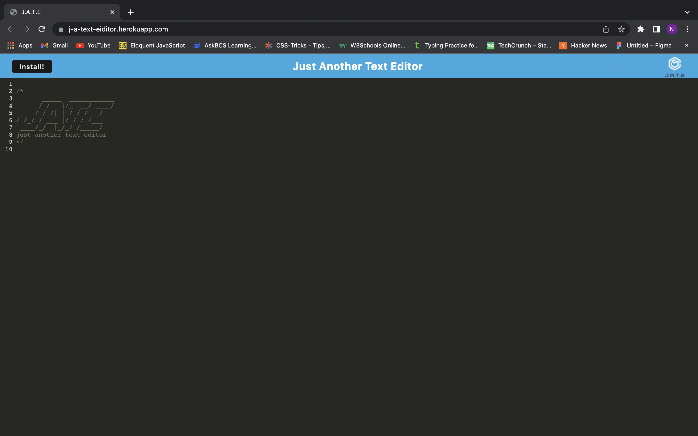

# Text Editor
## Description
allows user to write user to write code in browser

## Installation

- run 'npm i' in terminal

## Usage
- run 'npm run start:dev ' in terminal

## Visuals
 

## Questions 

- Github: lilwill13

- noahsfuture18@gmail.com

## Tabel of contents

- [Description](#description)

- [Installation](#installation)

- [Usage](#usage)

- [Visuals](#visuals)

- [Questions](#questions)